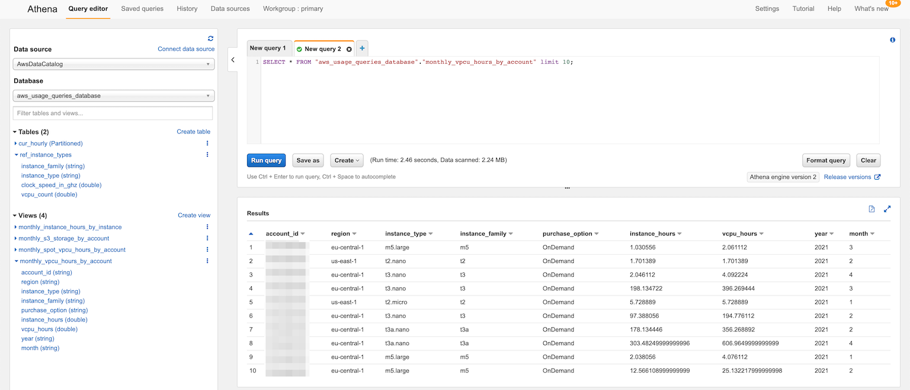
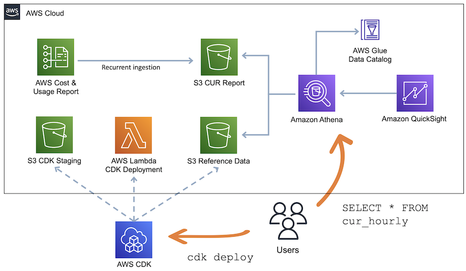

# AWS usage queries

If you want to identify the top AWS usage in your AWS accounts the [AWS Cost and Usage reports](https://docs.aws.amazon.com/cur/latest/userguide/what-is-cur.html) (CUR) have much of the data required. You can [query the CUR data through Amazon Athena](https://docs.aws.amazon.com/cur/latest/userguide/cur-query-athena.html).

This repository is an AWS Cloud Development Kit (CDK) template that bootstraps:

- AWS Glue catalog metadata in your account to query the CUR
- additional reference data you can use to enrich your queries - such as instance type information
- common queries as AWS Glue views, e.g. EC2 instance vCPU hours by account and month

You can modify the template to add your own data and queries.



## Architectural Overview



## Get Started

**Coming soon**: deploy the sample template from the AWS Serverless Application Repository.

### Compile the CDK template

The CDK template is written in TypeScript. TypeScript sources must be compiled to JavaScript initially and after each modification. Open a new terminal and keep this terminal open in the background if you like to change the source files. Change the directory to the one where `cdk.json` is and execute:

```bash
npm install
npm run watch
```

Read the [CDK developer guide](https://docs.aws.amazon.com/cdk/latest/guide/home.html) for more information.

### Deployment using CDK

Create or update the application with `cdk deploy`. You must provide parameters used when [creating cost and usage reports](https://docs.aws.amazon.com/cur/latest/userguide/cur-create.html). The CUR data must be stored in Apache Parquet format.

```bash
cdk deploy \
    --parameters CurBucketName=<bucket name> \
    --parameters ReportPathPrefix=<path without leading or trailing slash> \
    --parameters ReportName=<report name> \
    --databaseName=<optional databasename override, default: aws_usage_queries_database>
```

### Access the queries

You can find the queries deployed via the Amazon Athena console. You can choose **Preview** next to each view or run a query like:

```
SELECT * FROM <see databaseName parameter above>."monthly_s3_storage_by_account" limit 10;
```

## Cleaning Up

To avoid incurring charges, delete the AWS CloudFormation stack when you are finished experimenting via `cdk destroy` in the directory where `cdk.json` is:

```bash
cdk destroy
```

Or delete the AWS CloudFormation stack manually:

* Sign in to the AWS CloudFormation console and choose your stack.
* Choose **Delete** to delete all resources, including the bucket that stores the reference data.

## FAQs

### Q: Can I use CUR information stored in an other AWS account?

Yes. You can use a bucket policy for [cross-account access in Athena to Amazon S3 buckets](https://docs.aws.amazon.com/athena/latest/ug/cross-account-permissions.html) or you [setup cross-account replication of the report bucket](https://docs.aws.amazon.com/AmazonS3/latest/userguide/replication-walkthrough-2.html).

### Q: Why is my CUR data not being delivered to the report bucket?

Make sure your Amazon S3 bucket is granting the [permissions for Cost and Usage Reports](https://docs.aws.amazon.com/cur/latest/userguide/cur-s3.html) to PUT the CUR data into the bucket.

### Q: How much do resources in this template cost?

Standard AWS charges apply to the resources you deploy with this template. For the query cost read the [Amazon Athena pricing](https://aws.amazon.com/athena/pricing/) and [AWS Glue pricing](https://aws.amazon.com/glue/pricing/) for details. For the storage and requests to CUR data in your Amazon S3 bucket read the [Amazon S3 Pricing](https://aws.amazon.com/s3/pricing/). When creating the CUR report select *Enable report data integration for Athena*. That way the report data is written with the Apache Parquet columnar format which usually results in better performance and cost optimization for both Amazon S3 and Amazon Athena.

### Q: How can I refresh the instance types

The instance types come from the EC2 API. Query and write it to a file:

```{bash}
echo "instance_family,instance_type,clock_speed_in_ghz,vcpu_count" \
    > referenceData/instanceTypes/data.csv
aws ec2 describe-instance-types \
    --output text \
    --query 'InstanceTypes[*].[InstanceType, ProcessorInfo.SustainedClockSpeedInGhz, VCpuInfo.DefaultVCpus]' \
    | sed -E 's/[[:blank:]]+/,/g' \
    | sed -E 's/^(([^.]+).*)/\2,\1/' \
    | sort >> referenceData/instanceTypes/data.csv
```

### Q: How can I add a new question to this list?

If you found yourself wishing this set of frequently asked questions had an answer for a particular problem, please [submit a pull request](https://help.github.com/articles/creating-a-pull-request-from-a-fork/). The chances are good that others will also benefit from having the answer listed here.

### Q: How can I contribute?

See the [Contributing Guidelines](CONTRIBUTING.md) for details.

## Security

See [CONTRIBUTING](CONTRIBUTING.md#security-issue-notifications) for more information.

## License

This library is licensed under the MIT-0 License. See the LICENSE file.
